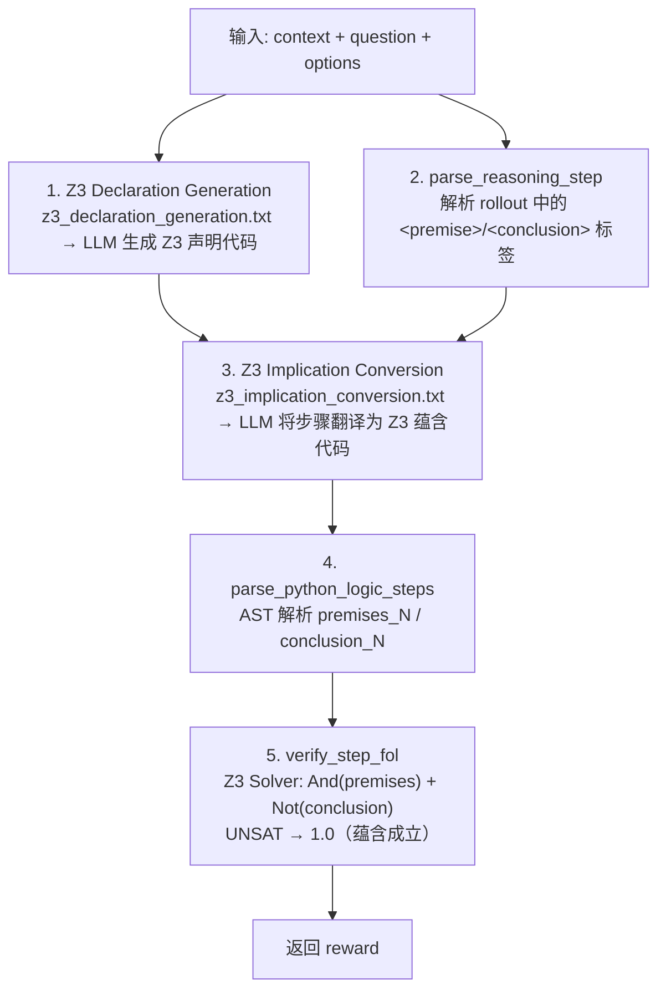
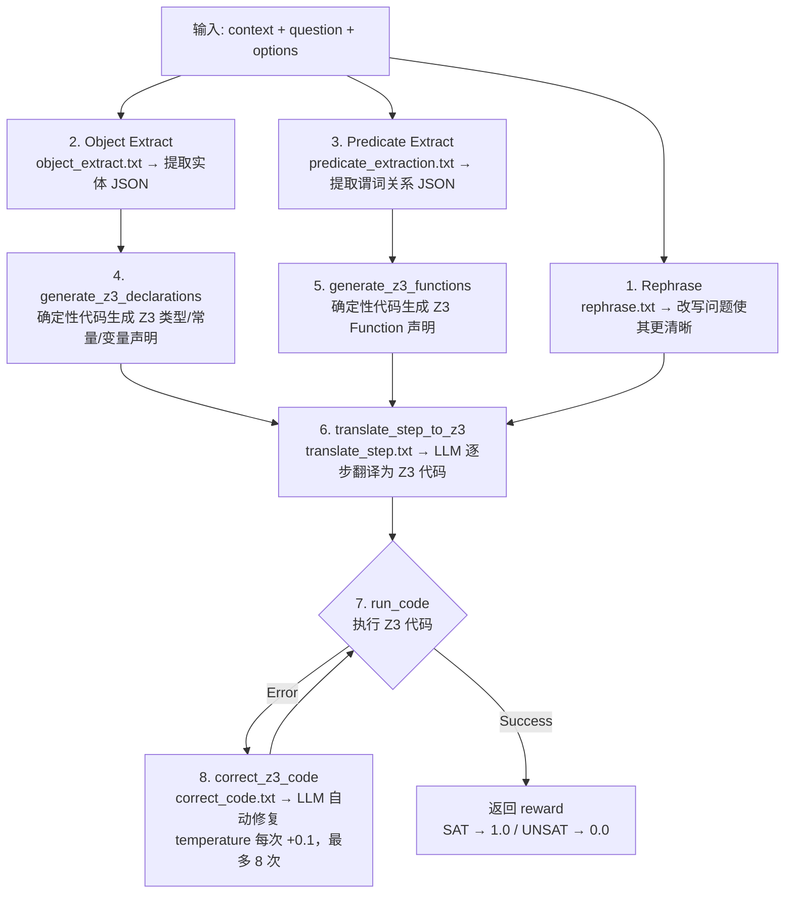
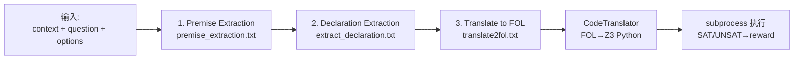

# verl: Volcano Engine Reinforcement Learning for LLMs (Forked)

This is a customized fork of [verl](https://github.com/volcengine/verl) tailored for logical reasoning tasks, process reward-based reinforcement learning methods (Step-GDPO, parallel generation or tree search), and specialized dataset preprocessing pipelines & prompting for LogiQA datasets.

For the original verl library's detailed documentation and features, please refer to [README-bytedance.md](README-bytedance.md).

---

## LogiQA Dataset Preprocessing & Prompting

The LogiQA dataset preprocessing allows injecting custom reasoning instructions (e.g., `p1 & p2 -> i1` for step-wise logical inferences) via flexible prompt file configurations.

### Version, Format, # of samples, and Output Directory

You can customize the LogiQA dataset loading and preprocessing by configuring a few parameters in `logiqa.py`:

- `--version`: Specifies LogiQA dataset version (`1` for `lucasmccabe/logiqa` or `2` for `baber/logiqa2`). Default is `1`.
- `--num_samples`: The number of training samples to keep. Use `-1` for all samples. Default is `2000`.
- `--local_save_dir`: The directory to save the output `.parquet` files. Default is `./data/logiqa2k`.
- `--format`: Prompt formatting style. Default is `flat`.
  - `flat`: Regular plain text format (`Context: ...\n\nQuestion: ...\n\nOptions: ...`).
  - `xml`: XML tag format (`<Context>...\n</Context>\n<Question>...`).

**Example:**

Version 1, 2000 samples, XML text format (the used version)

```bash
python examples/data_preprocess/logiqa.py \
    --version 1 \
    --num_samples 2000 \
    --local_save_dir ./data/logiqa2k \
    --format xml \
    --system_prompt_file logical_reasoning.txt
```

### Prompt-v2 Parquet Generation

The `verl-fol-2` experiment scripts expect prompt-v2 parquet files by default. Generate them before launching new prompt-v2 baselines:

```bash
bash bash_scripts/prepare_logiqa2k_prompt_v2.sh
```

This writes:

```text
data/logiqa2k_prompt_v2/train.parquet
data/logiqa2k_prompt_v2/validation.parquet
data/logiqa2k_prompt_v2/test.parquet
```

The default prompt file is `verl/prompts/logical_reasoning.txt`. It is the main FOL/Z3-aware prompt with MCQ-safe A/B/C/D examples.

To generate the shorter prompt variant:

```bash
PROMPT_FILE=logical_reasoning_2.txt \
DATA_DIR=./data/logiqa2k_prompt_v2_short \
bash bash_scripts/prepare_logiqa2k_prompt_v2.sh
```

Equivalent explicit command:

```bash
python examples/data_preprocess/logiqa.py \
    --version 1 \
    --num_samples -1 \
    --format xml \
    --local_save_dir ./data/logiqa2k_prompt_v2 \
    --system_prompt_file logical_reasoning.txt
```

Prompt changes do not affect existing parquet files. Regenerate parquet whenever `logical_reasoning.txt` or `logical_reasoning_2.txt` changes.

For ReClor, use the same prompt-v2 format and A/B/C/D answer labels:

```bash
bash bash_scripts/prepare_reclor_prompt_v2.sh
```

This writes labeled splits only:

```text
data/reclor_prompt_v2/train.parquet
data/reclor_prompt_v2/validation.parquet
```

The official ReClor test split is unlabeled, so the script skips it by default.
To save it for generation-only inspection:

```bash
bash bash_scripts/prepare_reclor_prompt_v2.sh --save_unlabeled_test
```

The new experiment scripts use:

```bash
trainer.project_name='verl-fol-2'
DATA_NAME=${DATA_NAME:-logiqa2k_prompt_v2}
```

You can still run against another dataset directory by overriding:

```bash
DATA_DIR=./data/logiqa2k_prompt_v2 bash bash_scripts/fol_step_gdpo_localjudge_boost.sh
```

### Local Judge Boost Setup

The `fol_*_localjudge_boost.sh` scripts assume an OpenAI-compatible FOL judge is
already running. The recommended setup is two tensor-parallel Qwen3.6-35B-A3B
judge servers behind the local load balancer:

```bash
CUDA_VISIBLE_DEVICES=0,1 python3 -m vllm.entrypoints.openai.api_server \
    --model /root/run/models/Qwen3.6-35B-A3B \
    --served-model-name Qwen3.6-35B-A3B \
    --port 4872 \
    --tensor-parallel-size 2 \
    --max-model-len 12288 \
    --gpu-memory-utilization 0.95 \
    --max-num-seqs 256 \
    --enable-prefix-caching \
    --max-cudagraph-capture-size 256

CUDA_VISIBLE_DEVICES=5,6 python3 -m vllm.entrypoints.openai.api_server \
    --model /root/run/models/Qwen3.6-35B-A3B \
    --served-model-name Qwen3.6-35B-A3B \
    --port 4873 \
    --tensor-parallel-size 2 \
    --max-model-len 12288 \
    --gpu-memory-utilization 0.95 \
    --max-num-seqs 256 \
    --enable-prefix-caching \
    --max-cudagraph-capture-size 256

python3 scripts/openai_lb.py \
    --host 127.0.0.1 \
    --port 4874 \
    --backend http://127.0.0.1:4872 \
    --backend http://127.0.0.1:4873 \
    --timeout 700
```

Then point FOL training at the load balancer:

```bash
OPENAI_BASE_URL=http://127.0.0.1:4874/v1 \
OPENAI_API_KEY=EMPTY \
FOL_MODEL=Qwen3.6-35B-A3B \
FOL_OPENAI_MAX_INFLIGHT=512 \
bash bash_scripts/fol_step_gdpo_localjudge_boost.sh
```

For scripts that start their own local judge vLLM, the same server-side defaults
are enabled in the script: prefix caching, `VLLM_MAX_NUM_SEQS=256`, and
`VLLM_MAX_CUDAGRAPH_CAPTURE_SIZE=256`. Override those environment variables only
when the judge server has memory pressure or needs a different concurrency cap.

## LogiQA Prompt-v2 Baseline Snapshot

Snapshot from local logs on 2026-05-02. Accuracy is `val-core/logiqa/acc/mean@1`;
percentages are reported to three decimal places.
For active runs, the "final/current" column reports the latest available validation
instead of a completed final checkpoint.

| Method | Log | Train GPU | Judge / Eval GPU | Best Val Acc | Final / Current Val Acc | Notes |
|---|---|---:|---:|---:|---:|---|
| GSPO outcome-only | `train_gspo_outcome_only_logiqa_full_prompt1_gpu4_v1.log` | GPU4 | none | `48.848% @1200` | `36.866% @1844` | DAPO/outcome reward with GSPO policy loss, `seq-mean-token-mean`, KL off |
| FOL Step-GDPO v4 | `train_fol_step_gdpo_gpu2_v4_2.log` | GPU2 | GPU0/1 + GPU5/6 via `:4874` LB | `47.926% @550` | `42.704% @1844` | Completed; final checkpoint also evaluated on held-out test |
| DAPO outcome-only | `train_dapo_outcome_only_logiqa_full_prompt1_gpu4_v1.log` | GPU4 | none | `45.315% @750` | `39.017% @1844` | Outcome-only GRPO/DAPO baseline |
| Self-eval Step-GDPO v1 | `train_self_eval_step_gdpo_gpu4_v1.log` | GPU4 | GPU4 local `:8199` | `45.161% @1050/1500` | `38.556% @1844` | Completed |
| Format Step-GDPO | `train_format_step_gdpo_a800_gpu0_v1.log` | A800 GPU0 | none | `44.700% @600/1400` | `36.252% @1844` | A800 baseline |
| Format Tree-GAE | `train_format_tree_gae_a800_gpu1_v1.log` | A800 GPU1 | none | `40.399% @550` | `28.879% @1844` | Short-tree collapse by the end |
| Outcome-only Tree-GAE | `train_outcome_tree_gae_a800_gpu2_v1.log` | A800 GPU2 | none | `39.939% @400` | `31.183% @1844` | Short-tree collapse by the end |
| FOL Tree-GAE v4 | `train_fol_tree_gae_gpu3_v4.log` | GPU3 | GPU0/1 + GPU5/6 via `:4874` LB | `38.710% @1050` | `27.957% @1844` | Negative result for current tree shaping; final `num_steps/mean=2.0` |
| Self-eval Tree-GAE v1 | `train_self_eval_tree_gae_gpu4_v1.log` | GPU4 | GPU4 local `:8199` | `39.017% @1700` | `31.183% @1844` | Tree baseline remained weak |

Held-out LogiQA test results use `data/logiqa2k_prompt_v2/test.parquet` as
`data.val_files` with `trainer.val_only=true`. LogiQA validation and test each
contain 651 examples in this preprocessing.

| Method | Checkpoint | Test Acc | Test Log | Notes |
|---|---:|---:|---|---|
| Qwen2.5-1.5B-Instruct base | none | TBD | TBD | Priority next test-only run on H20 |
| GSPO outcome-only | `global_step_1844` | `43.318%` | `test_gspo_outcome_only_logiqa_final1844_remote.log` | Final checkpoint |
| FOL Step-GDPO v4 | `global_step_1844` | `47.158%` | `test_fol_step_gdpo_logiqa_final1844.log` | Pure answer accuracy; `validate_with_step_reward=false`, so no FOL judge calls |
| DAPO outcome-only | `global_step_1844` | `42.550%` | `test_dapo_outcome_only_logiqa_final1844_remote.log` | Final checkpoint |

## ReClor Prompt-v2 Snapshot

ReClor uses `data/reclor_prompt_v2`; the official test split is unlabeled, so
these are validation results on 500 labeled validation examples.

| Method | Log | Best Val Acc | Final Val Acc | Notes |
|---|---|---:|---:|---|
| Qwen2.5-1.5B-Instruct base | `train_fol_step_gdpo_reclor_gpu2_v4.log` | `48.600% @0` | `48.600% @0` | Initial validation before RL |
| FOL Step-GDPO v4 | `train_fol_step_gdpo_reclor_gpu2_v4.log` | `58.600% @450` | `58.000% @579` | Final train score `52.344%`; final FOL step reward `55.469%` |
| GSPO outcome-only | `train_gspo_outcome_only_reclor_gpu4_v1.log` | running | running | Started after FOL run |
| DAPO outcome-only | `train_dapo_outcome_only_reclor_gpu3_v1.log` | running | running | Started after FOL run |

Current priority after this snapshot:

1. Run held-out LogiQA test for the Qwen2.5-1.5B-Instruct base model.
2. Monitor ReClor GSPO/DAPO baselines against the FOL Step-GDPO `58.600%` best.
3. Run held-out LogiQA test for remaining retained checkpoints: self-eval Step-GDPO, FOL Tree-GAE, and A800 tree baselines.
4. Run FOL Step-GDPO with GSPO/DAPO-style optimization controls:
   `seq-mean-token-mean`, KL ablations, then `policy_loss.loss_mode=gspo`.
5. For tree search, first run the clean 5:5 ablation:
   `+algorithm.step_reward_weights='[0.5, 0.5]'`.
6. If 5:5 still collapses to short paths, add tree-only outcome gating for paths
   with too few rewardable XML reasoning steps.

Version 1, 2000 samples, plain text format:

```bash
python examples/data_preprocess/logiqa.py \
    --version 1 \
    --num_samples 2000 \
    --local_save_dir ./data/logiqa2k \
    --system_prompt_file logical_reasoning.txt
```

Version 1, all samples, plain text format:

```bash
python examples/data_preprocess/logiqa.py \
    --version 1 \
    --num_samples -1 \
    --local_save_dir ./data/logiqa \
    --system_prompt_file logical_reasoning.txt
```

Version 2, 5000 samples, XML format:

```bash
python examples/data_preprocess/logiqa.py \
    --version 2 \
    --num_samples 5000 \
    --format xml \
    --local_save_dir ./data/logiqa5k_v2_xml \
    --system_prompt_file logical_reasoning.txt
```

Injection of Logic Reasoning Prompt:

```bash
python examples/data_preprocess/logiqa.py \
    --version 2 \
    --num_samples 5000 \
    --format xml \
    --local_save_dir ./data/logiqa5k_v2_xml \
    --system_prompt_file logical_reasoning.txt
```

### Prompting

```bash
# 只加 system prompt（读取 verl/prompts/logical_reasoning.txt）
python examples/data_preprocess/logiqa.py \
    --system_prompt_file logical_reasoning.txt

# 只加 user prompt（在题目后追加）
python examples/data_preprocess/logiqa.py \
    --user_prompt_file logical_reasoning.txt

# 两个都加（system + user 各用不同的 txt）
python examples/data_preprocess/logiqa.py \
    --system_prompt_file my_system.txt \
    --user_prompt_file my_user_instructions.txt

# 传绝对路径也支持
python examples/data_preprocess/logiqa.py \
    --system_prompt_file /path/to/any_prompt.txt
```

## Training Parameters

### Process Reward Type

Process reward (step-level reward) 用于对推理链中的**每一步**独立评分，而非只看最终答案。通过 `algorithm.step_reward_type` 配置。

| 参数 | 说明 |
|------|------|
| `algorithm.step_reward_type` | 步级奖励类型，支持以下值 |
| `algorithm.step_reward_weights` | `[outcome_weight, process_weight]`，控制结果奖励与过程奖励的混合比例，默认 `[1.0, 1.0]`。fol/self_eval 推荐 `[0.8, 0.2]`，format 可用 `[0.5, 0.5]` |
| `algorithm.use_xml_steps` | 是否使用 XML 标签（`<step>...</step>`）解析步骤边界，默认 `False` |

**可选 reward type：**

| Type | 计算方式 | 返回值 | 外部依赖 |
|------|----------|--------|----------|
| `format` | 正则匹配 XML 格式 | 二值 0.0 / 1.0 | 无 |
| `fol` | Z3 求解器验证一阶逻辑可满足性 | 连续 [0, 1] | OpenAI API |
| `self_eval` | LLM 按 rubric 评分（0-10 → 归一化到 [0,1]） | 连续 [0, 1] | OpenAI 兼容 API |
| `random` | 随机分数（调试用） | 连续 [0, 1] | 无 |

**FOL / Self-Eval API 环境变量：**

```bash
export OPENAI_API_KEY="sk-YOUR-KEY-HERE"
export OPENAI_BASE_URL="https://api.openai.com/v1"
export FOL_MODEL="gpt-4o-mini-2024-07-18"       # fol 模式
export SELF_EVAL_MODEL="Qwen2.5-1.5B-Instruct"  # self_eval 模式
```

### Step-GDPO

Step-GDPO（`algorithm.adv_estimator=step_gdpo`）在 GRPO 基础上引入步级奖励，将 outcome reward 和 process reward 以 "big-pool" 归一化方式组合。

**核心配置：**

```bash
algorithm.adv_estimator=step_gdpo
reward_model.reward_manager=step
+algorithm.step_reward_type=fol          # 或 format / self_eval
+algorithm.step_reward_weights='[0.8, 0.2]'  # [outcome, process]  (format 可用 [0.5, 0.5])
algorithm.use_xml_steps=true
```

| 参数 | 默认值 | 说明 |
|------|--------|------|
| `algorithm.adv_estimator` | — | 设为 `step_gdpo` |
| `reward_model.reward_manager` | — | 设为 `step` |
| `algorithm.step_reward_type` | — | 步级奖励类型（`fol` / `format` / `self_eval`） |
| `algorithm.step_reward_weights` | `[1.0, 1.0]` | `[outcome_weight, process_weight]`。fol/self_eval 推荐 `[0.8, 0.2]` |
| `algorithm.use_xml_steps` | `False` | 使用 XML 标签解析步骤边界 |

**Advantage 计算流程：**

1. **Outcome Advantage**：标准 GRPO 组内归一化（标量奖励 → token 级 advantage）
2. **Process Advantage**：将同组所有 rollout 的步级分数汇入 "big pool"，统一 mean/std 归一化后放回各步结束位置
3. **加权求和**：`A[i,t] = w_outcome × A_outcome + w_process × A_process`
4. **Reward-to-Go**：从右向左累积求和
5. **Batch Whitening**：最终 batch 级白化

### Tree Search (TreeRL)

Tree-GAE（`algorithm.adv_estimator=tree_gae`）基于 EPTree（arXiv:2506.11902）实现树搜索 RL 训练。在推理过程中对高不确定性节点进行分叉搜索，通过树结构探索更多推理路径。

**核心配置：**

```bash
algorithm.adv_estimator=tree_gae
reward_model.reward_manager=tree
+trainer.tree_sampling=True
+trainer.tree_rounds=1
+trainer.tree_top_n=2
+trainer.tree_branches=2
+trainer.tree_mask_tail_ratio=0.1
```

**树搜索参数：**

| 参数 | 默认值 | 说明 |
|------|--------|------|
| `trainer.tree_sampling` | `False` | 开启树搜索模式 |
| `trainer.tree_rounds` | `1` | 树搜索轮数 L |
| `trainer.tree_top_n` | `2` | 每轮选 top-N 高不确定性节点扩展 |
| `trainer.tree_branches` | `2` | 每节点分叉数 T |
| `trainer.tree_mask_tail_ratio` | `0.1` | 尾部 token 遮蔽比例，防止退化扩展 |

EPTree 参数组合示例 **(M=6, N=2, L=1, T=2)**：初始采样 6 条（`rollout.n=6`），每轮选 2 节点各分 2 叉，最终约 **30 条叶子路径**。

**Advantage Pipeline 参数：**

| 参数 | 默认值 | 可选值 | 说明 |
|------|--------|--------|------|
| `trainer.tree_step_reward_mode` | `la` | `ga_la` / `ga` / `value_only` | 步级奖励计算方式（la = V(sn) - V(parent)） |
| `trainer.tree_overall_norm_style` | `token` | `step` / `none` | 步级奖励归一化粒度 |
| `trainer.tree_use_weighted_value` | `False` | `True` | 是否使用加权 value 计算叶子得分 |
| `trainer.tree_weighted_value_style` | `sqrt` | `uniform` / `original` | 加权方式（仅 `use_weighted_value=True` 时生效） |
| `algorithm.tree_ext_reward_dedup` | `True` | `False` | 共享前缀节点的外部 PRM 分数去重 |

**可选外部 PRM：**

Tree-GAE 可叠加外部 process reward（`format` / `fol` / `self_eval`），此时 `step_reward_weights` 语义变为 `[tree_weight, ext_prm_weight]`：

```bash
+algorithm.step_reward_type=fol             # 或 format / self_eval
+algorithm.step_reward_weights='[0.8, 0.2]' # format 可用 [0.5, 0.5]
+algorithm.tree_ext_reward_dedup=True
```

若不配置外部 PRM（如 `outcome_tree_gae.sh`），则退化为纯树结构 advantage。

## Training Scripts

### DAPO

DAPO is the original baseline method explored prior to Step-GDPO. It mitigates mode collapse via an overlong-buffer mechanism.

#### Sanity Check

```bash
bash bash_scripts/sanity_check_dapo.sh
```

#### One Epoch Training

```bash
bash bash_scripts/one_epoch_dapo.sh
```

### Step-GDPO + Parallel Sampling

Step-GDPO is the core algorithm currently under development, leveraging First-Order Logic (FOL) API evaluations as step-wise rewards during training.

#### Sanity Check with Random Reward

Useful for validating the local training loop with a dummy random reward provider:

```bash
bash bash_scripts/sanity_check_step_gdpo.sh
```

#### One Epoch Training with FOL Reward

Set up the OpenAI-compatible API details for remote FOL step evaluation:

```bash
export OPENAI_API_KEY="sk-YOUR-KEY-HERE"
export OPENAI_BASE_URL="https://api.openai.com/v1"
export FOL_MODEL="gpt-4o-mini-2024-07-18"

bash bash_scripts/fol_step_gdpo.sh
```

### Step-GDPO + TreeRL (Entropy-guided Branching Tree Search) Sampling

TODO: Tree search configurations and documentation to be added.

## Slurm Integration

The repository is built to work flexibly with Slurm workloads. You can use `srun` to submit your jobs. Here is an example of running the GDPO sanity check on a single A800 GPU:

```bash
srun -p gpu_a800 -G1 bash -c "export PYTHONUNBUFFERED=1; bash bash_scripts/sanity_check_step_gdpo.sh" 2>&1 | tee run_$(date +%Y%m%d_%H%M%S).log
```

# Baseline 训练脚本 Walkthrough

> 所有脚本位于 `bash_scripts/`，统一使用 **Qwen2.5-1.5B-Instruct** 模型、**logiqa2k** 数据集、1 GPU 单节点、1 epoch 训练。

---

## 1. 脚本总览

| 类别 | 脚本 | adv_estimator | reward_manager | step_reward_type | weights | rollout.n | 外部依赖 |
|------|------|---------------|----------------|------------------|---------|-----------|----------|
| **DAPO** | `one_epoch_dapo.sh` | grpo | dapo | 无 (纯 outcome) | — | 16 | 无 |
| | `sanity_check_dapo.sh` | grpo | dapo | 无 (纯 outcome) | — | 16 | 无 |
| **Step-GDPO** | `fol_step_gdpo_{1gpu,local,remote}.sh` | step_gdpo | step | fol | [0.8, 0.2] | 16 | OpenAI API |
| | `fol_step_gdpo_localjudge_boost.sh` | step_gdpo | step | fol | [0.8, 0.2] | 16 | 本地 vLLM |
| | `fol_slm_step_gdpo_{1gpu,local,remote}.sh` | step_gdpo | step | fol | [0.8, 0.2] | 16 | 本地 vLLM (GPU 1in2) |
| | `format_step_gdpo.sh` | step_gdpo | step | format | [0.5, 0.5] | 16 | 无 |
| | `self_eval_step_gdpo_{1gpu,local,remote}.sh` | step_gdpo | step | self_eval | [0.8, 0.2] | 16 | OpenAI API / 本地 vLLM |
| | `sanity_check_step_gdpo.sh` | step_gdpo | step | format | [0.5, 0.5] | 16 | 无 |
| | `sanity_check_fol_step_gdpo.sh` | step_gdpo | step | fol | [0.8, 0.2] | 16 | OpenAI API |
| | `sanity_check_self_eval_step_gdpo.sh` | step_gdpo | step | self_eval | [0.8, 0.2] | 16 | OpenAI API / 本地 vLLM |
| **Tree-GAE** | `fol_tree_gae_{1gpu,local,remote}.sh` | tree_gae | tree | fol | [0.8, 0.2] | 6 (30) | OpenAI API |
| | `fol_tree_gae_localjudge_boost.sh` | tree_gae | tree | fol | [0.8, 0.2] | 6 (30) | 本地 vLLM |
| | `fol_slm_tree_gae_{1gpu,local,remote}.sh` | tree_gae | tree | fol | [0.8, 0.2] | 6 (30) | 本地 vLLM (GPU 1in2) |
| | `format_tree_gae.sh` | tree_gae | tree | format | [0.5, 0.5] | 6 (30) | 无 |
| | `outcome_tree_gae.sh` | tree_gae | tree | 无 (纯 outcome) | — | 6 (30) | 无 |
| | `self_eval_tree_gae_{1gpu,local,remote}.sh` | tree_gae | tree | self_eval | [0.8, 0.2] | 6 (30) | OpenAI API / 本地 vLLM |
| | `sanity_check_tree_gae.sh` | tree_gae | tree | format | [0.5, 0.5] | 6 (30) | 无 |

> **weights 列说明**：`[outcome, process]`。fol/self_eval 等 LLM-based reward 使用 `[0.8, 0.2]` 以防止 process reward hacking（详见下文）；format 等低 exploit 风险的 reward 保持 `[0.5, 0.5]`。

---

## 2. 训练算法

### DAPO（对照组）

DAPO 是最基础的 GRPO baseline，用于对照实验。

**核心配置**

```bash
algorithm.adv_estimator=grpo
reward_model.reward_manager=dapo
```

**特有参数：overlong_buffer**

DAPO 必须开启超长惩罚，否则模型会出现模式崩溃（重复生成 token）：

```bash
+reward_model.reward_kwargs.overlong_buffer_cfg.enable=True
+reward_model.reward_kwargs.overlong_buffer_cfg.len=512        # 缓冲区长度
+reward_model.reward_kwargs.overlong_buffer_cfg.penalty_factor=1.0
+reward_model.reward_kwargs.max_resp_len=2048
```

惩罚逻辑：如果响应长度超过 `max_resp_len - overlong_buffer_len`（即 2048 - 512 = 1536 token），则按超出比例扣分。

| 脚本 | 用途 | 训练步数 | WandB |
|------|------|----------|-------|
| `one_epoch_dapo.sh` | 完整 1 epoch 训练 | 全量 | 开启 |
| `sanity_check_dapo.sh` | 快速验证 | 5 步 | 关闭 |

---

### Step-GDPO

Step-GDPO 在 GRPO 基础上引入**步级奖励**，将每个推理步骤独立评分，而非只看最终答案。

**与 DAPO 的关键差异**

```diff
- algorithm.adv_estimator=grpo
+ algorithm.adv_estimator=step_gdpo

- reward_model.reward_manager=dapo
+ reward_model.reward_manager=step

+ algorithm.step_reward_type=format|fol|self_eval  # 步级奖励类型（见第 3 节）
+ algorithm.step_reward_weights=[0.8, 0.2]          # [outcome_weight, process_weight]
+ algorithm.use_xml_steps=true                       # 用 XML 标签解析步骤边界

- overlong_buffer_cfg (DAPO 特有，Step-GDPO 不需要)
```

`step_reward_weights=[0.8, 0.2]`：第一个权重对应结果正确性（outcome），第二个对应步级过程质量（process reward）。fol/self_eval 等 LLM-based reward 推荐 `[0.8, 0.2]`（见下文 Anti-Reward-Hacking 说明），format 等低风险 reward 可用 `[0.5, 0.5]`。

| 脚本 | step_reward_type | 说明 |
|------|------------------|------|
| `format_step_gdpo.sh` | format | 纯格式奖励，无外部依赖 |
| `fol_step_gdpo.sh` | fol | FOL 一阶逻辑奖励，需要 OpenAI API |
| `self_eval_step_gdpo_remote.sh` | self_eval | LLM 评分，远程 API |
| `self_eval_step_gdpo_local.sh` | self_eval | LLM 评分，本地 vLLM (GPU 1/2) |
| `sanity_check_step_gdpo.sh` | 可选 | 快速验证（5 步） |

---

### Tree-GAE（TreeRL 树搜索）

Tree-GAE 基于 EPTree（arXiv:2506.11902）实现树搜索 RL 训练。与 Step-GDPO 的"线性推理链"不同，Tree-GAE 在推理过程中进行分叉搜索，通过树结构探索更多推理路径。

**与 Step-GDPO 的关键差异**

```diff
- algorithm.adv_estimator=step_gdpo
+ algorithm.adv_estimator=tree_gae

- reward_model.reward_manager=step
+ reward_model.reward_manager=tree

- rollout.n=16
+ rollout.n=6    # 树会分叉扩展，实际评估路径数远大于 6

+ trainer.tree_sampling=True
+ trainer.tree_rounds=1          # 树搜索轮数 L
+ trainer.tree_top_n=2           # 每轮选 top-N 节点扩展
+ trainer.tree_branches=2        # 每节点分叉数 T
+ trainer.tree_mask_tail_ratio=0.1
```

**EPTree 参数**（当前配置 M=6, N=2, L=1, T=2）：

- **M=6**：初始采样 6 条响应（`rollout.n=6`）
- **N=2**：每轮选 top-2 节点 (`tree_top_n=2`)
- **L=1**：1 轮树搜索 (`tree_rounds=1`)
- **T=2**：每节点 2 个分支 (`tree_branches=2`)
- 最终产生约 **30 条叶子路径** 用于 advantage 计算

**Advantage Pipeline 参数**

| 参数 | 默认值 | 可选值 | 说明 |
|------|--------|--------|------|
| `tree_step_reward_mode` | la | ga_la / ga / value_only | 步级奖励模式（la = local advantage） |
| `tree_overall_norm_style` | token | step / none | 归一化粒度 |
| `tree_use_weighted_value` | False | True | 是否使用加权 value |
| `tree_weighted_value_style` | sqrt | uniform / original | 加权方式（仅 use_weighted_value=True 时生效） |
| `tree_ext_reward_dedup` | True | False | 去重共享前缀的 ext PRM 分数 |

在 Tree-GAE 中，`step_reward_weights` 的语义变为：第一个权重对应树结构内生 advantage（GA+LA），第二个对应外部 PRM 奖励。fol/self_eval 推荐 `[0.8, 0.2]`，format 可用 `[0.5, 0.5]`。

| 脚本 | step_reward_type | 说明 |
|------|------------------|------|
| `outcome_tree_gae.sh` | — (纯 outcome) | 退化为 (GA+LA)/sqrt(n) 作为唯一 advantage |
| `format_tree_gae.sh` | format | 树搜索 + format 外部 PRM |
| `self_eval_tree_gae_remote.sh` | self_eval | 树搜索 + LLM 评分，远程 API |
| `self_eval_tree_gae_local.sh` | self_eval | 树搜索 + LLM 评分，本地 vLLM (GPU 1/2) |
| `sanity_check_tree_gae.sh` | 可选 | 快速验证（5 步） |

---

## 3. Process Reward 模式

三种步级奖励类型可与 Step-GDPO 或 Tree-GAE 组合使用，通过 `+algorithm.step_reward_type=<type>` 指定。

| 维度 | format | fol | self_eval |
|------|--------|-----|-----------|
| **计算方式** | 正则匹配 XML 格式 | Z3 求解器验证逻辑可满足性 | LLM 按 rubric 评分 |
| **返回值** | 二值 0.0 / 1.0 | 连续 [0, 1] | 连续 [0, 1]（10分制/10） |
| **外部依赖** | 无 | OpenAI API + Z3 | OpenAI 兼容 API |
| **延迟** | 极低（纯文本匹配） | 中（API 调用） | 中（API 调用） |
| **终止步检测** | 不区分 | 不区分 | 区分（\boxed{} 启发式，结论加权） |
| **步骤历史** | 只看当前步 | 只看问题上下文 | 传入完整累积推理历史 |
| **适用场景** | 验证输出格式规范 | 逻辑推理题 (LogiQA) | 通用推理任务 |
| **可用训练算法** | Step-GDPO / Tree-GAE | Step-GDPO | Step-GDPO / Tree-GAE |

---

### format

正则匹配每步 XML 标签格式，无外部依赖，二值返回。脚本：`format_step_gdpo.sh`、`format_tree_gae.sh`。

---

### fol

当前仓库的 FOL rewarding pipeline 如下（整合自 T0nglinziyong 的方案）：



- TODO: 是否加回来 DeBERTa NLI 双轨验证 — 原版有 `verify_steps_nli`（DeBERTa）和 `verify_steps_fol`（Z3）两条轨道做对比，整合版只保留 Z3 单轨

环境变量：

```bash
export OPENAI_API_KEY=${OPENAI_API_KEY:-"sk-YOUR-KEY-HERE"}
export OPENAI_BASE_URL=${OPENAI_BASE_URL:-"https://api.openai.com/v1"}
export FOL_MODEL=${FOL_MODEL:-"gpt-4o-mini-2024-07-18"}
```

LLM 调用次数：每道题 1 次（declarations），每步 1 次（implication conversion）。

#### `api_config` 参数

通过 reward manager 的 `api_config` dict 传入，控制 FOL pipeline 的行为：

| 参数 | 默认值 | 可选值 | 说明 |
|------|--------|--------|------|
| `fol_task_type` | `"logic"` | `"logic"` / `"math"` | 任务类型。`logic` 使用 entity-predicate schema（适用于 LogiQA、FOLIO、AR-LSAT 等逻辑推理）；`math` 使用纯 Int/Real 算术 schema（适用于 GSM8K 等算术应用题） |
| `fol_preprocess` | `"direct"` | `"direct"` / `"structured"` | 预处理管线。`direct` = 1 次 LLM 调用生成 Z3 声明；`structured` = rephrase + object/predicate 提取的多步管线 |
| `fol_translation` | `"implication"` | `"implication"` / `"assertion"` | 翻译模式。`implication` = 源分离的前提/结论翻译（推荐）；`assertion` = premise_fol/conclusion_fol 直接翻译 |
| `fol_cumulative_mode` | `"current_only"` | `"current_only"` / `"step"` / `"dependency_graph"` | 累积推理模式。`current_only` = 只用当前步骤；`step` = 包含所有前序结论；`dependency_graph` = 按前提-结论依赖图选择祖先步骤 |
| `fol_judge_use_outlines` | `false` | `true` / `false` | 是否请求结构化 JSON 输出（structured generation）。需要 judge 模型支持 json_schema response_format |
| `fol_format_failed_score` | `0.0` | 任意 float | 步骤格式不合法时（缺少 premise/conclusion 标签）的替代分值 |
| `max_tries` | `1` | int ≥ 0 | 声明/表达式修复的最大重试次数 |
| `old_max_tries` | `0` | int ≥ 0 | 整段 Z3 代码纠错循环的最大重试次数（旧版纠错路径） |
| `timeout` | `30.0` | float (秒) | Z3 求解器单步超时时间 |
| `model` | — | string | judge LLM 的模型名称 |
| `base_url` | — | string | judge LLM 的 OpenAI 兼容 API 地址 |
| `temperature` | — | float | judge LLM 采样温度 |
| `max_tokens` | — | int | judge LLM 最大输出 token 数 |
| `top_p` | — | float | judge LLM top-p 采样 |
| `fol_shared_state_disk_cache` | `true` | bool | 跨进程磁盘缓存声明预处理结果 |
| `fol_shared_state_cache_dir` | `"/tmp/verl_fol_shared_preprocess_cache"` | path | 声明缓存目录 |
| `fol_verify_disk_cache` | `true` | bool | 跨进程磁盘缓存验证结果 |
| `fol_verify_cache_dir` | `"/tmp/verl_fol_verify_cache"` | path | 验证缓存目录 |

#### `fol_task_type: "math"` 模式

为数学题设计的算术/代数验证路径。与默认 `logic` 模式的区别：

| | `logic`（默认） | `math` |
|--|---|---|
| **Schema** | Entity sorts + predicate functions（`DeclareSort`, `EnumSort`, `Function → BoolSort()`） | 纯 `Int`/`Real` 算术变量（`Const → IntSort()/RealSort()`） |
| **Declaration prompt** | `z3_declaration_generation.txt` | `z3_declaration_generation_math.txt` |
| **Translation prompt** | `z3_implication_conversion.txt` | `z3_implication_conversion_math.txt` |
| **验证语义** | 相同：`And(premises) ∧ Not(conclusion) → UNSAT = 1.0` | 相同 |
| **适用数据集** | LogiQA, FOLIO, AR-LSAT, ReClor | GSM8K, MATH-500（部分类别） |

**MATH-500 子类别覆盖情况：**

| 子类别 | Z3 覆盖 | 说明 |
|--------|---------|------|
| Prealgebra | ✅ 完全 | 基础算术、分数、百分比 |
| Algebra | ✅ 大部分 | 方程、多项式、不等式（Z3 nlsat solver） |
| Number Theory | ⚠️ 部分 | 整除 `%`、模运算、GCD/LCM 可以；归纳证明不行 |
| Counting & Probability | ⚠️ 有限 | 小规模计数可展开；无原生阶乘/组合数，归纳和组合恒等式不可表达 |
| Geometry | ⚠️ 部分 | 坐标几何（距离、斜率、面积）可以；综合几何证明和三角函数不行 |
| Intermediate Algebra | ⚠️ 部分 | 多项式运算可以；复杂非线性可能 timeout |
| Precalculus | ❌ 极有限 | Z3 无原生三角函数、复数、矩阵支持 |

Z3 覆盖不了的步骤会自然 fail-closed（返回 0.0），不会产生错误的正面奖励。对于需要完整 MATH-500 step-level 验证的场景，需要引入 Isabelle/HOL 定理证明器（参见 TODO.md）。

使用示例（训练配置中）：

```yaml
algorithm:
  step_reward_type: fol
  step_reward_api_config:
    fol_task_type: "math"       # 切换到数学模式
    fol_preprocess: "direct"
    fol_translation: "implication"
    model: "Qwen3.6-35B-A3B"
    base_url: "http://localhost:4869/v1"
```

核心文件：

- `verl/utils/reward_score/fol.py` — reward function 入口
- `verl/utils/fol_utils/engine.py` — 统一 FOL 验证引擎
- `verl/prompts/z3_declaration_generation.txt` — Z3 声明生成 prompt（logic）
- `verl/prompts/z3_implication_conversion.txt` — Z3 蕴含转换 prompt（logic）
- `verl/prompts/z3_declaration_generation_math.txt` — Z3 声明生成 prompt（math）
- `verl/prompts/z3_implication_conversion_math.txt` — Z3 蕴含转换 prompt（math）

------

### fol_slm

当前仓库的 FOL SLM rewarding pipeline 如下（整合自 ZhenbinChan 的方案，SLM = Small Language Model）：



环境变量：

```bash
export FOL_SLM_MODEL=${FOL_SLM_MODEL:-"qwen2.5-3b"}
export FOL_SLM_BASE_URL=${FOL_SLM_BASE_URL:-"http://localhost:4869/v1"}
export OPENAI_API_KEY=${OPENAI_API_KEY:-"EMPTY"}
```

与 `fol` 的关键差异：

| 维度       | fol                       | fol_slm                                       |
| ---------- | ------------------------- | --------------------------------------------- |
| LLM        | 外部大模型（GPT-4o-mini） | 本地小模型（qwen2.5-3b via vLLM）             |
| 声明生成   | LLM 直接生成 Z3 代码      | 结构化提取实体/谓词 → **确定性**代码生成      |
| 错误处理   | 单次执行                  | 自动修复循环（最多 8 次重试）                 |
| 验证语义   | 蕴含检查（UNSAT = 成立）  | 可满足性检查（SAT = 一致）                    |
| LLM 调用数 | 每题 1 + 每步 1           | 每题 3（rephrase/object/predicate）+ 每步 1~9 |

核心文件：

- `verl/utils/reward_score/fol_slm.py` — reward function 入口
- `verl/utils/fol_utils/nl2fol_slm.py` — pipeline 实现
- `verl/prompts/rephrase.txt`、`object_extract.txt`、`predicate_extraction.txt`、`translate_step.txt`、`correct_code.txt` — prompt 模板


---

### fol_old

（旧版本fol，不再使用）

调用 OpenAI API 使用 Z3 求解器验证一阶逻辑可满足性。环境变量：

```bash
export OPENAI_API_KEY=${OPENAI_API_KEY:-"sk-YOUR-KEY-HERE"}
export OPENAI_BASE_URL=${OPENAI_BASE_URL:-"https://api.openai.com/v1"}
export FOL_MODEL=${FOL_MODEL:-"gpt-4o-mini-2024-07-18"}
```

脚本：`fol_step_gdpo.sh`。

流程：




---

### self_eval

使用 LLM（通常是参考模型本身）对每个推理步骤进行 0-10 评分，归一化到 [0, 1]。

**核心实现**（`verl/utils/reward_score/self_eval.py`）

```
compute_step_reward_self_eval(step_text, prompt_text, step_history, ...)
    -> 判断是否为终止步（包含 \boxed{}）
    -> 选择对应的 system prompt (terminal / non_terminal)
    -> 将累积推理历史拼接为 user prompt
    -> 调用 LLM API 评分
    -> 正则提取 "Overall Score: <float>"
    -> 返回 score / 10.0，范围 [0, 1]
```

**评分 Rubric**

非终止步（`verl/prompts/self_eval/non_terminal.txt`）：

| 维度 | 分值 | 说明 |
|------|------|------|
| Premise Establishment | 0-2 | 前提信息和假设的清晰度 |
| Step Validity | 0-2 | 每步逻辑是否有效、格式良好 |
| Justification Quality | 0-2 | 是否引用了规则/公理/推理依据 |
| Logical Progression | 0-2 | 步骤间过渡是否流畅，无跳跃 |
| Conclusion | 0-2 | 当前步结论是否从前提中正确推出 |

终止步（`verl/prompts/self_eval/terminal.txt`）：结论维度加权到 4 分（占 40%），其余维度降权：

| 维度 | 分值 |
|------|------|
| Premise Establishment | 0-1 |
| Step Validity | 0-2 |
| Justification Quality | 0-1 |
| Logical Progression | 0-2 |
| **Conclusion** | **0-4** |

**部署模式**

Mode A（远程 API，1 GPU）：训练与评分共用同一 GPU，评分请求发往远程 API：

```bash
export OPENAI_BASE_URL="https://your-remote-server/v1"
export OPENAI_API_KEY="your-key"
export SELF_EVAL_MODEL="Qwen2.5-1.5B-Instruct"   # 可选
bash self_eval_step_gdpo_remote.sh
```

Mode B（本地 vLLM，2 GPU）：GPU 0 跑训练，GPU 1 启动 vLLM 服务充当评分 API：

```bash
export CUDA_VISIBLE_DEVICES=0,1
bash self_eval_step_gdpo_local.sh
```

local 脚本自动在 GPU 1 启动 vLLM server（默认端口 8199），等待就绪后在 GPU 0 启动训练，退出时自动 kill vLLM 进程。

**API 环境变量**（优先级：CLI 参数 > 环境变量 > 默认值）

| 环境变量 | 回退 | 默认值 | 说明 |
|----------|------|--------|------|
| `SELF_EVAL_MODEL` | `FOL_MODEL` | `gpt-4o-mini` | 评分模型名称 |
| `OPENAI_API_KEY` | — | `""` | API 密钥（本地用 `EMPTY`） |
| `OPENAI_BASE_URL` | — | `None` | API 端点 |

**Reward Manager 集成**（`step.py:122` / `tree.py:136`，懒加载，与 fol/format 注册方式一致）：

```python
if "self_eval" in self.step_reward_types:
    from verl.utils.reward_score.self_eval import compute_step_reward_self_eval
    if "self_eval" not in self.step_reward_fns:
        self.step_reward_fns["self_eval"] = compute_step_reward_self_eval
```

---

## 4. Anti-Reward-Hacking Penalty

### 背景

当 process reward（如 fol、self_eval）与最终任务目标（选择题正确率）不完全对齐时，模型可能学会 exploit process reward 信号而不是真正提升推理能力。典型症状包括：

- **Step 膨胀**：num_steps 从 ~8 涨到 25+，模型拆碎推理为大量局部正确但不推进解题的 step
- **长度爆炸**：response_length 冲向 max_response_length，clip_ratio 从 ~3% 涨到 40%+
- **格式退化**：多个 `\boxed{}`、`<step>`/`</step>` 不匹配、`<conclusion>` 出现在 `<step>` 外
- **局部重复**：同一 premise 换句话重复说，拆成多个 step 骗取 process reward
- **准确率坍塌**：val acc 持续下降（如 0.28 → 0.07），而 fol_step_reward/mean 持续上升

根因：Step-GDPO 的 reward-to-go（reverse cumsum）会将 step 数量作为乘数放大 process advantage。当 `step_reward_weights=[0.5, 0.5]` 且 step 数从 6 涨到 25 时，process 梯度信号远超 outcome，模型被激励写更多局部可判正的句子而非提高最终答案正确率。

### 修复策略

**权重调整**：fol/self_eval 脚本已从 `[0.5, 0.5]` 改为 `[0.8, 0.2]`，让 outcome advantage 主导优化方向。

**Penalty 机制**（`verl/experimental/reward_loop/reward_manager/step.py`）：当 response 出现 reward hacking 行为时，将该 response 的所有 process reward 置为 penalty_score（默认 0.0），切断 exploit 信号。

### 配置参数

| 参数 | 默认值 | 说明 |
|------|--------|------|
| `algorithm.penalty_max_steps` | `0`（禁用） | step 数超过此阈值时触发 penalty（推荐 12） |
| `algorithm.penalty_on_truncated` | `False` | response 被 max_response_length 截断时触发 |
| `algorithm.penalty_on_multi_boxed` | `False` | response 中出现多个 `\boxed{}` 时触发 |
| `algorithm.penalty_on_bad_format` | `False` | `<step>`/`</step>` 数量不匹配或 `<conclusion>` 在 `<step>` 外时触发 |
| `algorithm.penalty_score` | `0.0` | penalty 时所有 step reward 的替代分值（可设负值） |

### 使用示例

```bash
# 在现有脚本基础上追加 penalty 参数
+algorithm.penalty_max_steps=12 \
+algorithm.penalty_on_truncated=true \
+algorithm.penalty_on_multi_boxed=true \
+algorithm.penalty_on_bad_format=true \
+algorithm.penalty_score=0.0 \
```

当 penalty 触发时，reward_extra_info 中会记录 `process_reward_penalized=True` 和 `penalty_reason`（如 `"num_steps=25>12|truncated"`），方便日志排查。

---

## 5. 公用参数

以下参数在所有脚本中保持一致：

| 参数 | 值 | 说明 |
|------|-----|------|
| `model.path` | Qwen2.5-1.5B-Instruct | 基础模型 |
| `data` | logiqa2k (train + validation) | 数据集 |
| `max_prompt_length` | 2048 | 最大 prompt 长度 |
| `max_response_length` | 2048 | 最大响应长度 |
| `actor.optim.lr` | 1e-6 | 学习率 |
| `actor.use_kl_loss` | True | 开启 KL 散度损失 |
| `actor.kl_loss_coef` | 0.02 | KL 系数 |
| `actor.kl_loss_type` | low_var_kl | 低方差 KL |
| `rollout.temperature` | 0.8 | 采样温度 |
| `rollout.top_p` | 0.95 | top-p 采样 |
| `rollout.gpu_memory_utilization` | 0.5 | vLLM 显存占比 |
| `use_kl_in_reward` | False | reward 中不加 KL |
| `total_epochs` | 1 | 总训练轮次 |
| `test_freq` | 100 | 测试频率（步） |
| `n_gpus_per_node` | 1 | 每节点 GPU 数 |
